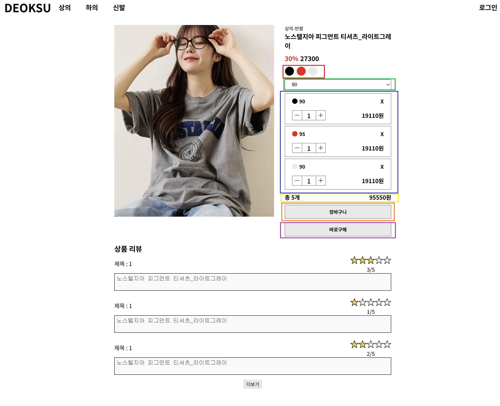
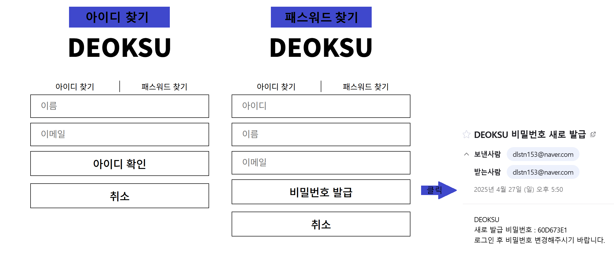
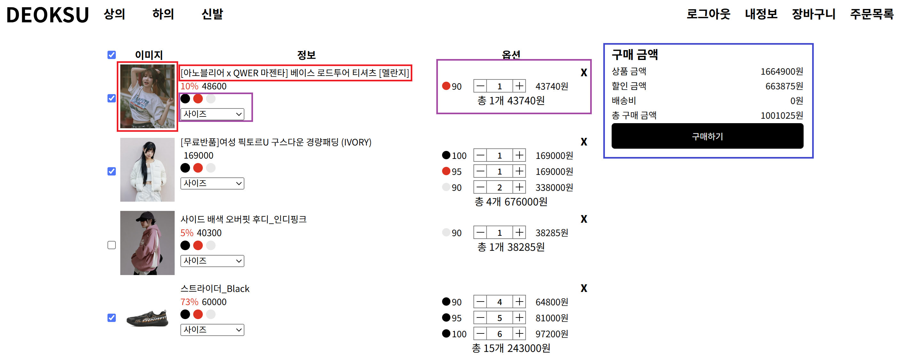

# SHOPPING PROJECT
퇴사 이후 웹 개발자로 1년이 넘어 가게 되면서 웹 개발에 대한 기억을 잊지 않고 새로운것을 추가하고자 이전에 했던 쇼핑몰과  추가적으로 AWS, Jenkins를 추가해서 프로젝트를 만들고자 합니다.
   

## 환경
- DB : mariadb(Oracle VM Rocky Linux)
- 언어 : JAVA
- 프레임워크 : SPRING BOOT
   

## DB 테이블

   

## 메인

- 빨강색 : 해당 카테고리 전체 목록
- 보라색 : 해당에 대한것만 보임
- 초록색 : 판매량 상위 10개
- 파랑색 : 로그인 페이지 이동
- 분홍색 : 해당 제품 판매 페이지 이동
   

## 카테고리별 목록 페이지

- 10개씩 목록 제품 목록 불러옴
- 빨강색 : 해당 제품 판매 페이지 이동
- 초록색 : 10개 제품 더 풀러옴(더보기 없으면 다음 제품 없음)
   

## 특정 제품 페이지

- 빨강색 : 제품에 존재하는 색(변경시 사이즈 배경 변경)
- 초록색 : 제품에 존재하는 사이즈
- 파랑색 : 색+사이즈 , 개수, 가격(개수*할인가) 표시, 해당 옵션 제거(x버튼, 개수 1개에서 - 클릭시)
- -, + 클릭으로 개수 수정
- 노랑색 : 총 개수, 총 가격
- 주황색 : 장바구니 추가
- 보라색 : 구매 페이지로 이동

## 로그인 페이지

- 아이디, 패스워드 입력 및 로그인 클릭
- 아이디/비밀번호 찾기 페이지 이동
- 회원가입 페이지 이동
   

## 회원가입

- 아이디 중복 확인
- 패스워드 8자이상
- 패스워드 확인
- 이메일, 핸드폰 유효성 검사
- daum API 주소
- 확인 버튼 클릭시 경고(빨간색 글씨) 없을시 저장 및 로그인 페이지 이동
- 취소 버튼 클릭시 로그인 페이지 이동
   

## 아이디/패스워드 찾기

- 이름, 이메일 입력 및 아이디 확인 버튼 클릭시 알람 창에 오픈
- 아이디, 이름, 이메일 입력 및 비밀번호 발급 클릭시 메일로 새로운 비밀번호 보냄
- 취소 버튼 클릭시 로그인 페이지 이동
   

## 로그인 해더

- 내정보, 장바구니, 주문목록 페이지 이동

## 장바구니

- 빨강색 : 썸네일, 이름 클릭시 해당 제품 페이지 이동
- 보라색 : 특정 제품 페이지와 기능 동일(단 X버튼 클릭시 다시 목록페이지에서 다시 찾아야 함)
- 파랑색 : 체크박스, 옵션 변경값에 따라 값이 변함
- 구매하기 버튼 클릭시 결제 전 최종 확인 페이지로 이동

## 주문서

- 구매하기 버튼 클릭시 결체창 오픈
- 배송지 변경 클릭시 배송지 변경창이 열립니다

## 배송지 변경창

- 빨강색 : 이름, 주소, 연락처 검색 입력
- 파랑색 : 배송치 추가 페이지로 넘어 갑니다
- 주황색 : 기본 배송지를 표기하며 1개만 가능 합니다.
- 노랑색 : 수정버튼 클릭시 배송지 수정 페이지로 넘어감, 삭제 버튼 클릭시 삭제

